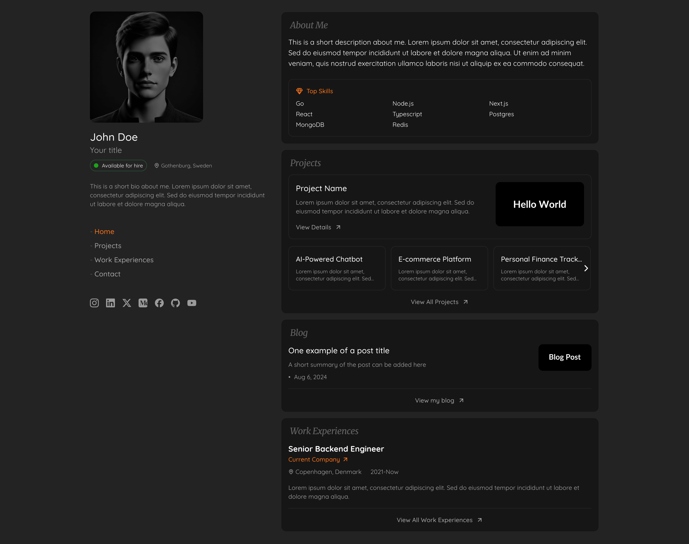

# JSON Web Builder (JWB)



Create your professional portfolio website in minutes by just updating JSON files! No coding required! 🚀

## What is JSON Web Builder?

JSON Web Builder is an open-source project that lets you create a beautiful, modern portfolio website without writing any code. Simply update the JSON files with your information, and your website is ready to showcase your:

- 👤 Professional Profile
- 💼 Projects
- 📝 Blog Posts
- 🛠️ Skills
- 📄 Work Experience
- 📱 Social Links
- 📧 Contact Information

## Features

- 🎨 Modern and responsive design
- ⚡ Built with React + TypeScript + Vite
- 🎯 SEO friendly
- 📱 Mobile-first approach
- 📄 Add custom pages
- ⚙️ Easy customization through JSON files
- 🎭 Animated transitions
- 🔧 Built with TailwindCSS and ShadCN for beautiful UI

## Quick Start

1. Clone the repository:

```bash
git clone https://github.com/dev3mike/jwb.git
cd jwb
```

2. Install dependencies:

```bash
npm install
```

3. Update your information:
Navigate to `src/data` and update the following files with your information:
- `profile.ts` - Your personal information
- `projects.ts` - Your projects
- `blog.ts` - Your blog posts
- `work-experiences.ts` - Your work history
- `social-links.ts` - Your social media links
- `contact.ts` - Your contact information
- `navigation.ts` - Website navigation structure
- `custom-pages.ts` - Add custom pages if needed

4. Start the development server:

```bash
npm run dev
```

5. Build for production:

```bash
npm run build
```

## Customization

All website content is controlled through TypeScript files in the `src/data` directory. No need to touch any React components or styling files! Just update the JSON objects in these files to reflect your information.

## Technologies Used

- React 18
- TypeScript
- Vite
- TailwindCSS
- Framer Motion
- React Router DOM
- ShadCN UI Components

## Contributing

Contributions are welcome! Feel free to:
1. Fork the repository
2. Create your feature branch
3. Commit your changes
4. Push to the branch
5. Create a Pull Request

## License

This project is licensed under the MIT License with attribution requirements. This means you are free to use, modify, and distribute the project, provided that you:

1. Include the original license and copyright notice
2. Provide appropriate credit to [JWB](https://github.com/dev3mike/jwb)
3. Include a link to the original repository

See the [LICENSE](./LICENSE) file for full details.

## Support

If you find any issues or have suggestions, please open an issue in the GitHub repository.

---

❤️ Innovative Bytes by [Masoud](https://masoudb.com)
